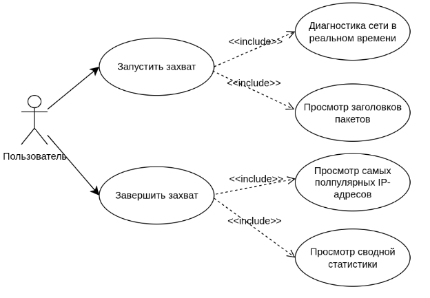
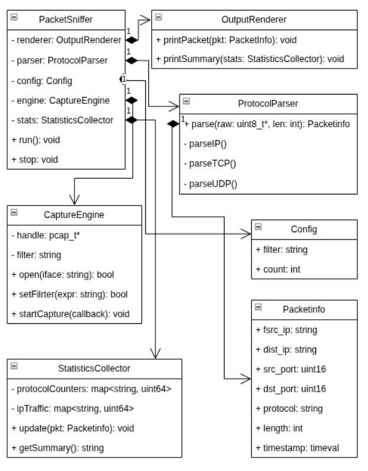
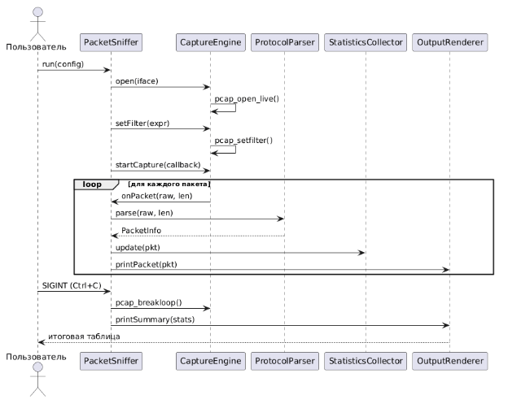

# Сетевой сниффер пакетов (анализатор трафика)

Лавренов Константин Сергеевич, ЭФБО-02-24

- [Введение](#часть-1-введение)
- [Общее описание](#часть-2-общее-описание)
- [Требования](#часть-3-детальные-требования)
- [Диаграммы UML](#часть-4-диаграммы-uml)
- [Паттерны](#часть-5-паттерны)
- [Тестирование](#часть-6-тестирование)
- [Развёртывание в Docker](#часть-7-развёртывание-в-docker)


## Часть 1. Введение

### 1.1 Цель

Целью данного проекта является разработка сетевого сниффера пакетов (анализатора трафика) на языке программирования C++ для перехвата и анализа сетевого трафика в режиме реального времени с использованием библиотеки libpcap.

### 1.2 Область действия

В область действия входит:

- **Захват данных**: перехват сетевых пакетов в режиме реального времени.
- **Анализ заголовков**: декодирование информации на сетевом (IP) и транспортном (TCP/UDP) уровнях.
- **Сбор метрик**: учет IP-адресов, протоколов, количества трафика.

### 1.3 Определения и аббревиатуры

- **Пакет** – это определенным образом оформленный блок данных, передаваемый по сети в пакетном режиме.
- **libpcap** – это библиотека для работы с возможностями Linux, которая предоставляет интерфейс для управления привилегиями процессов на уровне ядра.
- **Сетевой уровень** – это уровень модели OSI (The Open Systems Interconnection model), который предназначен для определения пути передачи данных, отвечает за трансляцию логических адресов и имен в физические, определение кратчайших маршрутов, отслеживание неполадок и "заторов" сети.
- **Транспортный уровень** – это уровень модели OSI, который предназначен для обеспечения надежной передачи данных от отправителя к получателю.
- **IP (Internet Protocol)** – это маршрутизируемый протокол сетевого уровня, который объединяет сегменты сети в единую сеть, обеспечивая доставку пакетов данных между любыми узлами сети через произвольное число промежуточных узлов (маршрутизаторов).
- **IP-адрес** – уникальный числовой идентификатор устройства в компьютерной сети, работающей по протоколу IP.
- **TCP (Transmission Control Protocol)** – один из основных протоколов передачи данных интернета, предоставляет поток данных с предварительной установкой соединения, осуществляет повторный запрос данных в случае потери данных и устраняет дублирование при получении копий одного пакета.
- **UDP (User Datagram Protocol)** – один из немногих ключевых элементов набора сетевых протоколов для интернета, использует простую модель передачи, без явных "рукопожатий" для обеспечения надежности, упорядочивания или целостности данных.

## Часть 2. Общее описание

### 2.1 Описание продукта

Сетевой сниффер пакетов (анализатор трафика) – это программный инструмент, написанный на языке программирования C++, предназначенный для перехвата и детального анализа сетевых пакетов, циркулирующих в компьютерной сети. Он использует библиотеку libpcap для захвата пакетов на уровне пользователя.

### 2.2 Функции продукта

- Живой захват трафика через libpcap
- Парсинг заголовков IP, TCP, UDP
- Вывод статистики

### 2.3 Характеристики пользователей

- **Системный администратор** – диагностика сети, мониторинг трафика
- **Специалист ИБ** – выявление аномалий, аудит соединений
- **Разработчик** – отладка приложений
- **Студент** – образовательные цели, изучение протоколов

## Часть 3. Детальные требования

### 3.1 Методологии сбора требований

Сбор требований выполнен с использованием agile-ориентированного подхода User Stories. Метод позволил сфокусироваться на ценности для конечного пользователя, а не на технических деталях реализации.

### 3.2 Требования

#### 3.2.1 Бизнес-требования

- Реализовать инструмент для мониторинга сетевого трафика.
- Обеспечить возможность аудита сетевой активности.
- Сократить время диагностики сетевых проблем.

#### 3.2.2 Пользовательские требования

- Как системный администратор, я хочу запустить захват трафика, чтобы диагностировать сетевые проблемы в реальном времени.
- Как специалист ИБ, я хочу видеть список IP-адресов с объемом трафика, чтобы обнаруживать подозрительную активность.
- Как студент, я хочу видеть заголовки пакетов в читаемом виде, чтобы понимать структуру сетевых протоколов.
- Как разработчик, я хочу видеть сводную статистику после остановки захвата, чтобы получить итоги сессии.

#### 3.2.3 Функциональные требования

- Система должна захватывать пакеты на указанном сетевом интерфейсе с использованием libpcap.
- Система должна отображать для каждого пакета: IP-адрес источника, IP-адрес назначения, протокол, длину.
- Система должна поддерживать протоколы TCP, UDP, IP.
- Система должна вести счетчики: количество пакетов и байт по каждому протоколу.
- Система должна выводить итоговую статистику при завершении.

#### 3.2.4 Нефункциональные требования

- **Надежность**: при некорректном пакете программа не должна завершаться аварийно.
- **Сопровождаемость**: необходимо покрыть код тестами и написать документацию.
- **Масштабируемость**: проект должен быть легко развивать в будущем.

## Часть 4. Диаграммы UML

### 4.1 Диаграмма вариантов использования (Use Case Diagram)




### 4.2 Диаграмма классов (Class Diagram)



### 4.3 Диаграмма последовательности (Sequence Diagram)



## Часть 5. Паттерны

### 5.1 Одиночка (Singleton)

Конфигурация программы (интерфейс, фильтр, путь к файлу) нужна в десятках мест одновременно. Без этого паттерна пришлось бы либо передавать объект конфигурации через каждый конструктор и метод по всей цепочке вызовов, либо создавать несколько копий, которые могли бы разойтись в состоянии. Этот паттерн гарантирует, что объект создаётся один раз при старте и любой модуль получает именно его.

### 5.2 Фабричный метод (Factory Method)

При получении каждого пакета нужно понять, TCP это или UDP, и создать соответствующий парсер. Без фабрики в коде захвата появился бы большой switch, жестко привязанный к конкретным классам парсеров – добавление любого нового протокола требовало бы правки этого кода. Фабрика изолирует логику выбора парсера в одном месте, и захват пакетов вообще не знает, какие конкретные классы существуют.

### 5.3 Наблюдатель (Observer)

Движок захвата должен одновременно кормить данными счетчик статистики и модуль вывода. Если прописать вызовы этих модулей напрямую внутри захвата, они намертво срастутся друг с другом. Observer позволяет подписать любое количество обработчиков на событие "пришел новый пакет", и движок захвата ничего не знает о том, кто именно подписан.

### 5.4 Фасад (Facade)

Внутри одновременно работают libpcap, цепочка парсеров, фабрика и наблюдатели. Без фасада main() был бы обязан знать обо всех этих деталях и вручную оркестровать их. PacketSniffer берёт всё это на себя, оставляя снаружи единственный вызов run().

### 5.5 Цепочка обязанностей (Chain of Responsibility)

Разбор пакета происходит послойно: сначала Ethernet-фрейм, потом IP-заголовок, потом транспортный уровень. Каждый обработчик знает только свою часть и передаёт управление следующему. Без этого паттерна весь разбор превратился бы в один монолитный метод, и добавление нового уровня потребовало бы переписывать общий код.

## Часть 6. Тестирование

Тестирование организовано на основе **GoogleTest** и собирается отдельной целью в CMake. Покрытие разделено на модульные (unit) тесты и сценарные (scenario) интеграционные тесты.

### 6.1 Модульные тесты (`unit_tests`)

Модульные тесты проверяют каждый компонент изолированно:

- test_config.cpp
- test_protocol_parser_factory.cpp
- test_handlers.cpp
- test_statistics_collector.cpp

### 6.2 Сценарные тесты

Помимо модульных тестов, есть три отдельных исполняемых файла-сценария, эмулирующих работу системы целиком на синтетических Ethernet/IP/TCP/UDP-кадрах:

- scenario_01_pipeline — полный цикл обработки пакета
- scenario_02_malformed — устойчивость к некорректным или повреждённым пакетам
- scenario_03_load — точность статистики под нагрузкой

### 6.3 Запуск тестов

```
./build/tests/unit_tests

./build/tests/scenario_01_pipeline
./build/tests/scenario_02_malformed
./build/tests/scenario_03_load
```

## Часть 7. Развёртывание в Docker

Для сборки и запуска проекта без локальной установки зависимостей (CMake, libpcap, GoogleTest) используется многоступенчатая (multi-stage) сборка на базе Alpine Linux.

### 7.1 Сборка образа

```
docker build -t packet-sniffer .
```

### 7.2 Запуск тестов в контейнере

```
# unit-тесты (команда по умолчанию)
docker run --rm packet-sniffer

# конкретный сценарный тест
docker run --rm packet-sniffer scenario_01_pipeline
docker run --rm packet-sniffer scenario_02_malformed
docker run --rm packet-sniffer scenario_03_load
```

### 7.3 Запуск сниффера

Захват трафика требует доступа к сетевым интерфейсам хоста и повышенных привилегий, поэтому контейнер нужно запускать с `--net=host` и `--cap-add=NET_RAW --cap-add=NET_ADMIN`:

```
docker run --rm \
  --net=host \
  --cap-add=NET_RAW \
  --cap-add=NET_ADMIN \
  packet-sniffer sniffer -i eth0
```